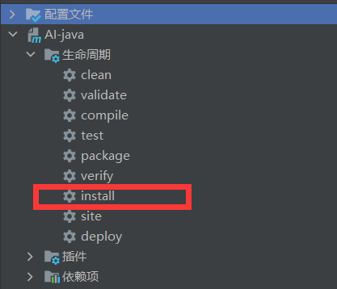
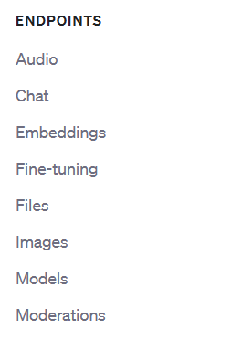

## **项目背景**

随着人工智能技术的飞速发展，自然语言处理在各个领域都具有广泛的应用前景。聊天机器人作为其中一种受欢迎且实用的解决方案，能够与用户进行自然对话，并提供有价值的信息和服务。

为了更好地利用ChatGPT模型，我们开发了一个名为ChatGPT API SDK的项目，专门针对Java编程语言。该SDK旨在简化与ChatGPT API的交互，使Java开发者可以轻松地集成ChatGPT的功能到他们的应用程序中。

该项目的主要目标如下：

1. **提供简单易用的接口：**我们致力于开发一个用户友好的SDK，提供简洁的方法和函数，使Java开发者能够轻松地与ChatGPT API进行通信。SDK应提供发送用户请求并接收ChatGPT生成的回复的便捷方法。
2. **支持流式应答：**实时生成响应，不需要等待整个对话结束。能够快速获得反馈，更加流畅地进行对话。流式应答能够为用户提供更接近真实人类对话的体验。用户可以即时提出问题、进行追问或做出反应，而ChatGPT能够相应地作出回应和调整。
3. **上下文管理：**ChatGPT模型是基于上下文的，因此我们希望SDK能够支持上下文的管理，允许用户在对话过程中保持和更新上下文信息。
4. **异常处理和错误处理：**我们将注重SDK的稳定性和可靠性，确保它能够有效地处理各种可能出现的错误和异常情况，并提供相应的异常处理机制。
5. **示例和文档：**为了方便Java开发者快速上手使用SDK，我们将提供详细的示例代码和清晰的文档，以解释如何正确集成和使用ChatGPT API SDK。

通过这个ChatGPT API SDK项目，我们旨在简化ChatGPT模型的使用，加快Java开发者在不同应用场景中集成聊天机器人功能的速度。

## 安装

下载项目到本地，将项目 install 到本地 maven 仓库。 



## 使用方式

**本项目目前实现了官方文档下 endpoints 各个板块全部的接口。**

 

首先创建sessionFactory，可通过sessionFactory获取不同场景下的会话窗口。

```java
// 1. 创建配置类
Configuration configuration = new Configuration();
// 2. 设置请求地址，若有代理商或者代理服务器，可填写为代理服务器的请求路径
configuration.setApiHost("https://api.openai.com");
// 3. 设置鉴权所需的API Key,可设置多个。
configuration.setKeyList(Arrays.asList("填入你的API Key"));
// 4. 设置请求时 key 的使用策略，默认实现了：随机获取 和 固定第一个Key 两种方式。
configuration.setKeyStrategy(new FirstKeyStrategy());
// 5. 设置代理，若不需要可不设置
configuration.setProxy(new Proxy(Proxy.Type.HTTP, new InetSocketAddress("127.0.0.1", 7890)));
// 6. 创建 session 工厂，制造不同场景的 session
OpenAiSessionFactory factory = new DefaultOpenAiSessionFactory(configuration);
```

通过sessionFactory获取聚合的不同场景的会话窗口。

```java
// 工厂创建聚合的session
AggregationSession aggregationSession = factory.openAggregationSession();

// 通过聚合的session获取不同场景的会话，处理不同场景，进行解耦。
// 获取聊天会话窗口
aggregationSession.getChatSession();
// 获取文件会话窗口
aggregationSession.getFilesSession();
// 获取微调会话窗口
aggregationSession.getFineTuningSession();
// 获取图片会话窗口
aggregationSession.getImageSession();
// 获取模型会话窗口
aggregationSession.getModelSession();
// 获取音频会话窗口
aggregationSession.getAudioSession();
// 获取审核会话窗口
aggregationSession.getModerationSession();
// 获取嵌入会话窗口
aggregationSession.getEmbeddingSession();
```

## 示例

```java
// 创建参数，上下文对话。
// 第一次的问题
ChatCompletionRequest chatCompletionRequest = ChatCompletionRequest.BuildBaseChatCompletionRequest("1+1=");
// 第一次的回复
chatCompletionRequest.getMessages().add(Message.builder().role(Constants.Role.ASSISTANT.getRoleName()).content("2").build());
// 第二次的问题
chatCompletionRequest.getMessages().add(Message.builder().role(Constants.Role.USER.getRoleName()).content("2+2=").build());
// 询问第二次的问题的结果
ChatCompletionResponse chatCompletionResponse = aggregationSession.getChatSession().chatCompletions(NULL, NULL, NULL, chatCompletionRequest);
// 解析结果
chatCompletionResponse.getChoices().forEach(e -> {
    log.info("测试结果：{}", e.getMessage());
});
```

更多示例请参考测试目录下各个场景的测试用例。[测试用例文件路径](https://github.com/mainpropath/AI-java/tree/master/src/test/java/com/ai/openAi)

**欢迎向本项目提需求~~~**
